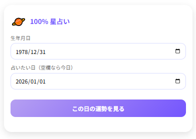
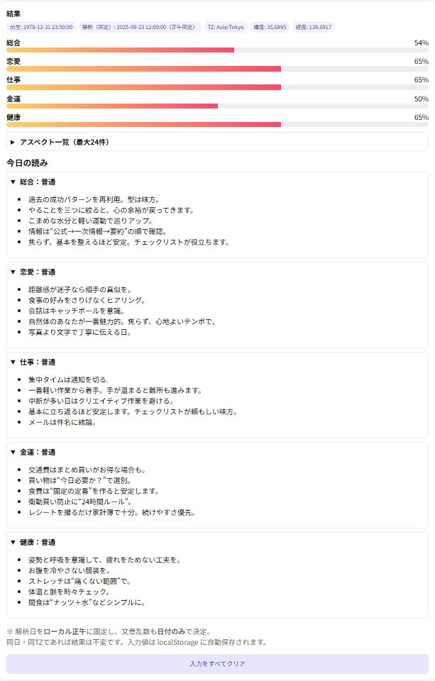

# 🌟 100% 星占い

**100% 星占い** は、惑星の配置を本格的に計算し、毎日の運勢を「100％スコア」で表示する占いアプリです。  
12星座占いのような大まかな分類ではなく、恋愛・仕事・金運・健康などを数値と解説で具体的に示します。

---

## 🚀 実行ページ
👉 [100% 星占い を開く](https://masato-nasu.github.io/horoscope-100pct/)

※ スマホでアクセスすると、ホーム画面に追加してアプリのように使えます。

---

## 📸 スクリーンショット

  
  

（`docs/` フォルダに PNG を入れてください）

---

## ✨ 特長
- **本格的な天体計算** — 惑星どうしの角度や強さを解析  
- **100％スコア表示** — 迷ったときに役立つ絶対評価  
- **ジャンル別アドバイス** — 恋愛・仕事・金運・健康を丁寧に解説  
- **毎日使える言葉** — 難しい専門用語なし、生活に寄り添う占い  

---

## 📱 インストール方法（PWA）

### Android（Chrome）
1. アプリのページを Chrome で開く  
2. 右上メニュー「︙」をタップ  
3. 「アプリをインストール」 または 「ホーム画面に追加」を選択  
4. ホーム画面にアイコン（ハート）が追加されます  

### iPhone / iPad（Safari）
1. アプリのページを Safari で開く  
2. 下部の共有ボタン「□↑」をタップ  
3. メニューから「ホーム画面に追加」を選択  
4. 右上の「追加」を押すと、ホーム画面にアイコン（ハート）が並びます  

---

## 🔮 アルゴリズム解説

### ① 天体位置計算
- ライブラリ: **astronomy-engine**  
- 出生日（出生地・時刻・タイムゾーン）と解析日（正午固定）の2つの時点での **黄経（Ecliptic Longitude = 天球上の360°座標）** を求めます。  
- 計算対象:  
  - 太陽・月・水星・金星・火星・木星・土星・天王星・海王星・冥王星  
  - ASC（Ascendant） / MC（Medium Coeli）

### ② アスペクト検出
Δ = |黄経A − 黄経B| を 0〜180°に正規化

markdown
コードをコピーする
- 0° ±8° → コンジャンクション  
- 60° ±6° → セクスタイル  
- 90° ±8° → スクエア  
- 120° ±8° → トライン  
- 180° ±8° → オポジション  

### ③ カテゴリ別スコア化
強度 × アスペクト重み × 惑星重要度

markdown
コードをコピーする
- 総合 … 太陽・月・木星・土星  
- 恋愛 … 金星・月・火星  
- 仕事 … 太陽・火星・土星  
- 金運 … 木星・金星  
- 健康 … 月・土星・火星  
- シグモイド関数で 0〜100% に正規化

### ④ 文章生成
- スコア区分  
  - 67%以上 → 好調  
  - 34〜66% → 普通  
  - 33%以下 → 注意  
- 各カテゴリ × 状態ごとのテンプレート文から選択  
- 乱数は日付固定 → 同じ日に同じ文が出る  

---

## 📝 まとめ
- **占星術の形式**をベースに  
- **天文計算は astronomy-engine**  
- **解釈はテンプレ＋確率制御**  

「半分本格・半分生成系」のアルゴリズムで、日々の運勢を100％スコアで示します。  
毎朝のチェックで、1日のヒントにしてください。
