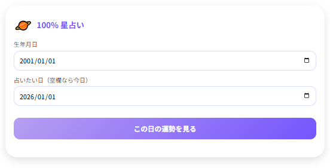
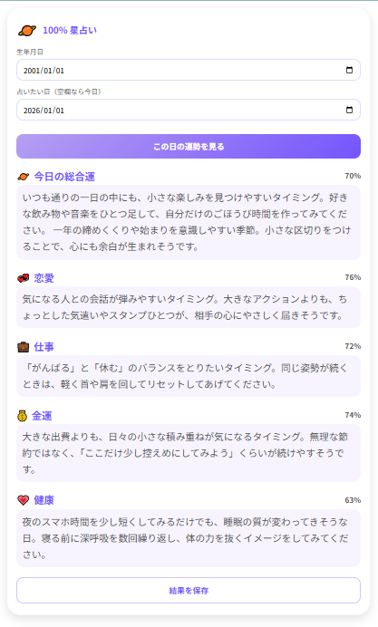

# 🌟 100% 星占い

**100% 星占い** は、  
**太陽〜土星の出生配置** と **占いたい日の天体配置** の「差（天体差）」をブラウザ内で計算し、  
その日の **総合運・恋愛・仕事・金運・健康** を **0〜100%** の数値と短い文章で表示する Web / PWA アプリです。

12星座の一般論ではなく、  
「その人の誕生日」と「占いたい日」の天体配置から、  
**その日だけの相性度カーブ** を作ることを目指しています。

---

## 🚀 実行ページ

👉 **https://masato-nasu.github.io/horoscope-100pct/**

スマートフォンで開いてホーム画面に追加すると、  
アプリのように全画面で使えます（PWA 対応）。

---

## 📸 スクリーンショット

**入力画面**

  

**結果画面**

  

---

## 🔮 主な機能

- **太陽〜土星までを使用した「天体差エンジン」**
  - 出生日の太陽・月・水星・金星・火星・木星・土星の黄経を計算
  - 占いたい日の同じ 7 天体の黄経と比較し、「どのくらい噛み合っているか」を数値化

- **5 つの分野を数値化**
  - 🪐 **総合運**
  - 💞 **恋愛**
  - 💼 **仕事**
  - 💰 **金運**
  - 💗 **健康**
  - それぞれ 0〜100% のバー表示と、短めの日本語メッセージで表示

- **日付指定に対応**
  - 「生年月日」と「占いたい日（空欄なら今日）」を入力して占えます
  - 同じ誕生日でも、占う日付を変えると数値が変化します

- **季節感のある一言**
  - 総合運の文章の最後に、  
    季節（春・夏・秋冬）に合わせた短い「季節トーン」の一文を追加

- **結果の画像保存**
  - 占い結果の下に **「結果を保存」ボタン** を表示  
  - ワンタップで結果画面を JPEG にしてダウンロードできます  
  - SNS 共有やスクラップ帳に貼る用途を想定

- **スマホフレンドリーなレイアウト**
  - 1 カラム構成・大きめ文字・カード型レイアウト
  - スマホ画面幅いっぱいに広がるデザイン（左右スクロールなし）

---

## 🧠 天体差エンジンの概要

> ※実際のコードは `index.html` 内にすべて埋め込まれています。

### 1. 7 天体の黄経を計算

- 使用ライブラリ：**Astronomy Engine（JavaScript版）**
- 対象天体：**太陽・月・水星・金星・火星・木星・土星**
- 出生日（ローカル日付）と、占いたい日（ローカル日付）のそれぞれについて  
  各天体の **黄経（黄道上の角度, 0〜360°）** を取得します。

### 2. 「出生配置」と「その日の配置」の差をとる

- 各天体ごとに、  
  `今日の黄経 − 出生時の黄経` を 0〜360° に正規化します。
- その差が  
  - **0° / 120° 付近**：とても相性が良い  
  - **60° / 240° / 300° 付近**：ほどよく良い  
  - **90° / 180° / 270° 付近**：調整が必要になりやすい  
  といった感じで、**角度ごとの重み（アスペクト重み）** を与えています。

この「アスペクトスコア」をもとに、  
各分野に合わせて天体を組み合わせていきます。

### 3. 分野別の天体の組み合わせ

- 🪐 **総合運**  
  - 背景：木星・土星・太陽  
  - 波：月・水星・金星・火星
- 💞 **恋愛**  
  - 背景：木星  
  - 波：金星・月・水星
- 💰 **金運**  
  - 背景：木星・土星  
  - 波：金星・火星・水星
- 💼 **仕事**  
  - 背景：土星  
  - 波：火星・水星・月・太陽
- 💗 **健康**  
  - 背景：木星  
  - 波：月・太陽・金星

それぞれ「背景（ゆっくり効いている流れ）」と  
「波（数日〜数週間のコンディション）」を合成し、  
分野ごとの **-1〜+1 の内部スコア** を作ります。

### 4. 「1年の中での位置づけ」と「近所の日との比較」

1. **年内（±90日）スキャン**
   - 占いたい日を中心に、前後約 3 か月ごと（3日刻み）に  
     同じロジックでスコアを計算
   - 「その年の中で見ると、どれくらい高め／低めの日か」を算出

2. **近傍（±16日）ウィンドウ**
   - 占いたい日の前後 16 日分を連続して計算
   - その 1 か月弱の中で、  
     「今日は上振れ気味か／平均くらいか／少し弱めか」を評価

3. **年スケール：ロングトレンド＋近傍スケール：デイリー差分**  
   - ロングトレンド（年）と近傍（±16日）の情報をブレンドして、  
     「誠実さは保ちつつ、ちゃんと日替わり感もある」ように調整しています。

### 5. 0〜100% へのマッピング

- 内部スコア（-1〜+1）を元に、  
  真ん中付近が **40〜60%** くらい、  
  良い日は **70〜90%**、  
  かなりレアな極大の日だけ **100%** になり得るようなカーブで変換します。
- いわゆる「毎日 90% ばかり」「ずっと 30% 台ばかり」にならないよう、  
  年単位・月単位の流れと、その日の相対的な位置付けの両方を見ています。

### 6. 文章生成

- 各分野のスコアから
  - 75〜100% … **a グレード**
  - 45〜74%  … **b グレード**
  - 0〜44%   … **c グレード**
  にざっくり分類します。
- `総合運 / 恋愛 / 仕事 / 金運 / 健康` × `a / b / c` それぞれに  
  複数の日本語テンプレートを用意し、  
  同じ点数帯でも **できるだけ同じ文章が続かないよう** 乱数で選択しています  
  （※同じ人・同じ日付では毎回同じ文章になるよう、  
  日付と誕生日から疑似乱数を固定しています）。

- 総合運には、最後に **季節のひとこと** をつなげて、  
  その日の空気感をほんの少しだけ足しています。

---

## 📱 使い方

1. ブラウザで  
   👉 `https://masato-nasu.github.io/horoscope-100pct/` にアクセス
2. 「生年月日」を入力
3. 「占いたい日」を入力（空欄なら今日）
4. 「この日の運勢を見る」をタップ
5. 下に、総合運＋4分野の結果が表示されます
6. 必要なら「結果を保存」ボタンで JPEG を保存

---

## 📲 PWA とキャッシュについて

このアプリは **PWA 対応** です。

- 初回アクセス時に Service Worker が登録され、  
  `index.html / manifest.json / sw.js / アイコン類 / 天文計算ライブラリ` をキャッシュします。
- その後は **オフラインでも起動・表示** できます。

### ホーム画面に追加（例）

- **Android（Chrome）**
  1. ページを Chrome で開く  
  2. 右上メニュー「︙」→「アプリをインストール」  
  3. ホーム画面に「100% 星占い」アイコンが追加されます

- **iPhone / iPad（Safari）**
  1. Safari でページを開く  
  2. 下部の「共有」アイコン →「ホーム画面に追加」  
  3. 「追加」を押すとホームにアイコンが並びます  

### バージョン更新が反映されないとき

ブラウザや PWA のキャッシュの影響で、  
更新がすぐ反映されないことがあります。

その場合は、URL の末尾に `?clear-sw=1` を付けてアクセスすると、  

- Service Worker の登録解除
- キャッシュの削除

を行ってからページを再読み込みします。

例：  
`https://masato-nasu.github.io/horoscope-100pct/?clear-sw=1`

---

## 📁 ファイル構成（概要）

- `index.html`  
  - HTML / CSS / JavaScript / 占いロジックをすべて 1 ファイルに集約
  - Astronomy Engine・html2canvas は CDN から読み込み

- `manifest.json`  
  - PWA 用のアプリアイコン、名前、テーマカラーなどの定義

- `sw.js`  
  - シンプルなキャッシュ戦略を持つ Service Worker  
  - バージョン文字列を変えるとキャッシュが更新されます

- `icon-192.png`, `icon-512.png`, `favicon.svg`  
  - PWA / ブラウザ用アイコン各種

- `screenshot-top.png`, `screenshot-result.png`  
  - README 用スクリーンショット

---

## ⚠️ 免責事項

このアプリは **エンターテインメント用途** を目的としたものであり、  
医療・法律・投資などの専門的な判断を行うものではありません。

大事な決定や健康・お金に関する判断は、  
必ずご自身の判断や専門家の意見とあわせてご利用ください。

---

## 💌 作者・連絡先

- GitHub: [Masato Nasu](https://github.com/Masato-Nasu)

不具合報告やご感想などがあれば、Issue や Pull Request でお知らせいただけると嬉しいです。
