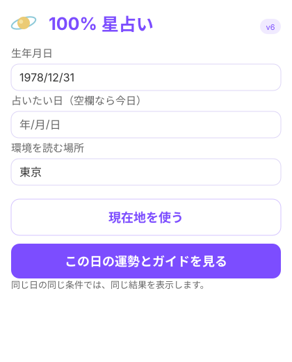
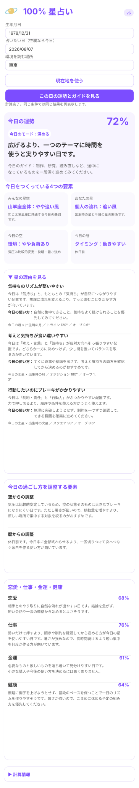

# 🪐 100% 星占い

**100% 星占い** は、生年月日と占いたい日、その日の空と暦を読み合わせて、  
**「今日をどう使うか」** を表示する Web / PWA アプリです。

v6 では、単に「今日は○％」と評価するだけではなく、結果の理由と、その日の過ごし方まで表示します。

> **同じ条件なら、同じ結果。**  
> 星は方向、環境は量、暦はタイミング。

結果生成に生成AIは使用していません。天体配置・気象・暦を一定のルールで計算するため、同じ条件からは同じガイドが得られます。

---

## 🚀 実行ページ

👉 **https://masato-nasu.github.io/horoscope-100pct/**

スマートフォンで開いてホーム画面に追加すると、PWAとしてアプリのように使えます。

---

## 📸 Screenshots

### 入力画面

<p align="center">
  
</p>

### 結果画面

<p align="center">
  
</p>

---

## 🔮 v6 で読む4つの要素

### 1. みんなの星空

太陽星座ごとの、その日の共通した星の基調です。  
一般的な12星座占いに近い層ですが、他サイトの結果をコピーするのではなく、現在の天体配置から内部計算します。

### 2. あなたの星

出生日の天体と、占いたい日の天体との関係です。  
太陽・月・水星・金星・火星・木星・土星について、**今日の天体 × 出生日の天体** を横断的に比較します。

### 3. 今日の空

選択した都市または現在地の、気圧・気温・湿度・降水・天候を読みます。  
空の状態を「吉凶」にはせず、**今日はどの程度動くか** を調整する材料として使います。

### 4. 今日の暦

平日・休日・祝日・休日前・連休などを見て、**動くタイミングや予定量** の読み方に反映します。

---

## 🧭 今日のモード

総合結果は％だけで終わらず、実用的な5つのモードに変換されます。

- **進める** — 公開、提案、連絡など、外へ一歩出す
- **つながる** — 相談、共有、会話、人とのやり取りを使う
- **深める** — 制作、研究、読み直しなど、一つを掘る
- **整える** — 修正、準備、片づけ、条件整理を優先する
- **守る** — 予定量を減らし、判断を急がず余白を残す

低い数字を「悪い日」とは扱いません。  
**その日の条件に合った使い方を示す**ことを目的にしています。

---

## ✨ 星の理由を表示

v6 では、結果に影響している主要アスペクトを最大3件表示します。

対象は西洋占星術でよく使われる5つの主要アスペクトです。

- **コンジャンクション** — 0°
- **セクスタイル** — 60°
- **スクエア** — 90°
- **トライン** — 120°
- **オポジション** — 180°

専門用語を先に出すのではなく、まず日常語で意味を表示します。

```text
気持ちのリズムが整いやすい
今日は「気持ち」と、もともとの「気持ち」が自然につながりやすい配置です。

今日の使い方：
自然に集中できること、気持ちよく続けられることを優先する。

今日の月 × 出生時の月
トライン 120° ／ オーブ 0.6°
```

角度やオーブを知りたい人は、その下で計算根拠も確認できます。

---

## 💞 💼 💰 🌿 4分野のガイド

総合運とは別に、以下の4分野を表示します。

- **恋愛**
- **仕事**
- **金運**
- **健康**

各分野は％だけでなく、**なぜその流れなのか / 今日どう使うか** を文章で表示します。

日運として毎日変化するよう、月・水星・金星・火星など比較的動きの速い天体を主役にし、木星・土星などの遅い天体は長期的な「背景」として弱めに反映します。

特に恋愛と金運では、遅い天体だけの影響で同じ低い結果が長期間続かないよう、**日々動く星を約80%、長期背景を約20%** として扱います。

---

## 🧠 計算の概要

### 天体計算

天体位置の計算には **Astronomy Engine 2.1.19** を使用しています。

対象天体：

- 太陽
- 月
- 水星
- 金星
- 火星
- 木星
- 土星

出生日の7天体と占いたい日の7天体を組み合わせ、主要アスペクトに入る関係を抽出します。

オーブの基本値は、太陽または月が関係する場合は最大 **8°**、その他は最大 **6°**。  
オーブが小さいほど、その配置を強く扱います。

> 現在のv6は出生時刻を入力しない簡易方式のため、出生日の天体位置は12:00を基準に計算します。

### 強い配置を平均で消さない

v6 では、多数の弱い配置を単純平均して50〜60%付近へ寄せるのではなく、  
**その日の強い配置を主役にし、次に強い配置がそれを後押しする / 打ち消す** 方式でスコア化します。

そのため、星の条件がはっきりしている日は、結果の振れ幅も大きくなります。

### 総合スコア

総合運は以下を基本比率として統合します。

| 要素 | 比率 |
| --- | ---: |
| あなたの星 | 60% |
| みんなの星空 | 20% |
| 今日の空 | 15% |
| 今日の暦 | 5% |

単純な加重平均ではなく、それぞれの**中立点からの差**を合成して、日ごとの差が埋もれないようにしています。

---

## 🌤️ 気象と暦

### Weather

気象データは **Open-Meteo** を使用します。

- 気温
- 湿度
- 海面気圧
- 6時間の気圧変化
- 降水量
- 天気コード

基本的にその日の **12:00** を基準に読みます。

### Holidays

日本の祝日は **Holidays JP API** を利用します。  
土日と組み合わせ、休日・休日前・休日最終日・連休中などを判定します。

---

## 🔁 再現性 — Same conditions, same result

100% 星占い v6 の重要な設計原則です。

同じ

- 生年月日
- 占いたい日
- 場所
- 保存されたその日の環境データ
- Horoscope Engine のバージョン

であれば、同じ結果になります。

気象データは、その日・その場所で最初に取得した値を端末内に保存します。  
同じ日に何度開いても、天気予報の更新だけで占い結果が勝手に変わらないようにしています。

翌日になれば、新しい日付として新しい環境データを取得します。

---

## 📱 使い方

1. 実行ページを開く
2. **生年月日**を入力
3. **占いたい日**を入力（空欄なら今日）
4. 環境を読む場所を選ぶ
   - 東京 / 大阪 / 京都 / 札幌 / 福岡
   - または **現在地を使う**
5. **この日の運勢とガイドを見る** を押す
6. 今日のモード、4要素、星の理由、空と暦の調整、4分野のガイドを読む

位置情報を許可しなくても、都市を選択すれば利用できます。

---

## 🗂️ 構成

```text
index.html      UI / PWA entry
v6-core.js      天体・気象・暦の計算
v6-guide.js     スコア統合・文章化・ガイド
v6-app.js       UI描画・入力・実行処理
sw.js           Service Worker
manifest.json   PWA manifest
```

---

## ⚠️ About this horoscope

このアプリは、占星術を**その日の過ごし方を考えるためのガイド**として扱う実験的なツールです。

占星術による未来予測が科学的に実証されているという意味ではありません。  
また、気圧・気温などの環境情報についても、特定の体調変化を医学的に断定するものではありません。

医療・法律・投資などの重要な判断には使用せず、必要に応じて専門家の情報とあわせてご利用ください。

---

## 💌 Author

- GitHub: [Masato Nasu](https://github.com/Masato-Nasu)
- Website: [MASATO LAB](https://masato-lab.pages.dev/)
