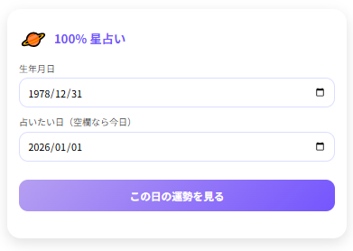
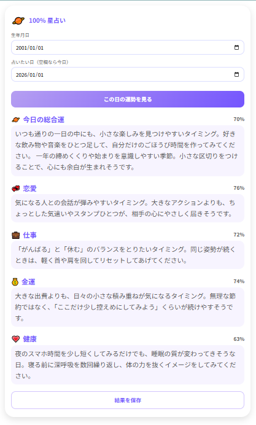

# 🌟 100% 星占い

**100% 星占い** は、誕生日と占いたい日を入力すると、  
その日の **総合運・恋愛・仕事・金運・健康** を **0〜100%** で表示する Web / PWA アプリです。

12星座の一般論ではなく、**太陽・月・水星・金星・火星・木星・土星** の出生配置と、占いたい日の天体配置の差をブラウザ内で計算し、  
その人とその日だけの運勢カーブを作ります。

また、最新バージョンでは、良い運勢や慎重な運勢が不自然に続きすぎないよう、  
最終表示に軽い **連続バランス補正** を加えています。

---

## 🚀 実行ページ

👉 **https://masato-nasu.github.io/horoscope-100pct/**

スマートフォンで開いてホーム画面に追加すると、  
アプリのように全画面で使えます。

---

## 📸 スクリーンショット

**入力画面**

<p align="center">
  
</p>

**結果画面**

<p align="center">
  
</p>

---

## 🔮 主な機能

- **生年月日と占いたい日から運勢を計算**
  - 占いたい日を空欄にすると、今日の運勢を表示します。
  - 同じ誕生日でも、日付を変えると結果が変わります。

- **5分野を0〜100%で表示**
  - 🪐 総合運
  - 💞 恋愛
  - 💼 仕事
  - 💰 金運
  - 💗 健康

- **太陽〜土星までの天体差を使用**
  - 出生日の7天体の黄経と、占いたい日の7天体の黄経を比較します。
  - 角度差から、その日の噛み合い方を数値化します。

- **連続しすぎを防ぐ表示補正**
  - A評価やC評価が長く続きすぎる場合、一定間隔でB評価寄りに調整します。
  - 天体計算そのものは残しつつ、占いとしての読み味が単調にならないようにしています。

- **結果画像の保存**
  - 結果画面をJPEGとして保存できます。
  - SNS共有や記録用のスクラップに使えます。

- **PWA対応**
  - ホーム画面に追加して、アプリのように起動できます。
  - Service Worker により、主要ファイルをキャッシュします。

---

## 🧠 アルゴリズム概要

### 1. 天体配置の取得

使用ライブラリは **Astronomy Engine（JavaScript版）** です。

対象天体は以下の7つです。

- 太陽
- 月
- 水星
- 金星
- 火星
- 木星
- 土星

出生日と占いたい日のそれぞれについて、各天体の **黄経（0〜360°）** を取得します。

### 2. 天体差のスコア化

各天体について、

```text
占いたい日の黄経 − 出生日の黄経
```

を 0〜360° に正規化し、角度差からアスペクト的な重みを計算します。

目安として、

- **0° / 120° 付近**：噛み合いやすい
- **60° / 240° / 300° 付近**：ほどよく流れがある
- **90° / 180° / 270° 付近**：調整が必要になりやすい

という考え方をベースにしています。

### 3. 分野別の合成

各分野では、効き方の遅い天体を「背景」、動きの速い天体を「波」として扱い、  
それらを組み合わせて **-1〜+1** の内部スコアを作ります。

- 🪐 **総合運**：木星・土星・太陽・月・水星・金星・火星
- 💞 **恋愛**：木星・金星・月・水星
- 💼 **仕事**：土星・火星・水星・月・太陽
- 💰 **金運**：木星・土星・金星・火星・水星
- 💗 **健康**：木星・月・太陽・金星

### 4. 年内スキャンと近傍比較

単純にその日の天体差だけを見るのではなく、  
占いたい日を中心にした前後の流れも見ています。

- **年内スキャン（±90日 / 3日刻み）**
  - その日が、前後数か月の中で高めなのか低めなのかを見ます。

- **近傍ウィンドウ（±16日）**
  - 約1か月の中で、今日は上振れ気味か、平均的か、弱めかを見ます。

この2つを混ぜることで、  
長期的な流れと日替わり感の両方を反映しています。

### 5. 0〜100%への変換

内部スコアを0〜100%に変換します。

- 通常の日は中間帯に寄りやすい
- 良い日は70〜90%台になりやすい
- かなり強い上振れの日だけ100%になり得る
- 低い日も15%未満には落ちにくい

この変換により、毎日極端な数字ばかりにならないようにしています。

### 6. 連続バランス補正

最新バージョンでは、良い日や慎重な日が続きすぎる問題を抑えるため、  
最終表示の段階で軽い補正を行っています。

グレードの目安は以下です。

- **A評価**：75〜100%
- **B評価**：45〜74%
- **C評価**：0〜44%

A評価またはC評価が3日以上続く場合、  
**3日目・6日目・9日目…** のような一定間隔で、表示をB評価帯に寄せます。

- A評価が続きすぎる場合：68〜73%付近に抑える
- C評価が続きすぎる場合：50〜57%付近に持ち上げる

これは天体計算を無効化するものではなく、  
**「良い良い良い…」「悪い悪い悪い…」という表示の単調さをやわらげるための表示バランス調整** です。

### 7. 文章生成

各分野のスコアを A / B / C に分類し、  
分野ごとの日本語テンプレートから文章を選びます。

同じ人・同じ日付では同じ文章になるよう、  
生年月日・日付・分野をもとに疑似乱数を固定しています。

また、同じ文章が続きにくくなるよう、  
年間スケジュール形式で文言の出方をある程度ばらしています。

総合運には、季節に合わせた短いひとことも追加されます。

---

## 📱 使い方

1. 実行ページを開く  
   👉 https://masato-nasu.github.io/horoscope-100pct/
2. 「生年月日」を入力
3. 「占いたい日」を入力
   - 空欄の場合は今日の日付で占います
4. 「この日の運勢を見る」を押す
5. 総合運・恋愛・仕事・金運・健康の結果が表示されます
6. 必要に応じて「結果を保存」でJPEGを保存します

---

## 📲 PWA / キャッシュ更新

このアプリはPWA対応です。

初回アクセス時に Service Worker が登録され、以下のファイルをキャッシュします。

- `index.html`
- `manifest.json`
- `sw.js`
- アイコン類
- `splash.css` / `splash.js`
- Astronomy Engine

更新がすぐ反映されない場合は、以下のようにURL末尾に `?clear-sw=1` を付けてアクセスしてください。

```text
https://masato-nasu.github.io/horoscope-100pct/?clear-sw=1
```

これにより、Service Worker の登録解除とキャッシュ削除を行い、最新版を読み込み直します。

---

## 📁 ファイル構成

```text
horoscope-100pct/
├─ index.html              # HTML / CSS / JavaScript / 占いロジック
├─ README.md               # このファイル
├─ manifest.json           # PWA設定
├─ sw.js                   # Service Worker
├─ splash.css              # 起動画面用CSS
├─ splash.js               # 起動画面用JS
├─ favicon.svg             # favicon
├─ icon-180.png            # iOS向けアイコン
├─ icon-192.png            # PWAアイコン
├─ icon-512.png            # PWAアイコン
├─ screenshot-top.png      # README用スクリーンショット
└─ screenshot-result.png   # README用スクリーンショット
```

---

## 🛠 更新履歴メモ

- 天体差エンジンによる5分野スコア表示
- 結果画像保存に対応
- PWA / Service Worker 対応
- 良い運勢・慎重な運勢が続きすぎる場合の連続バランス補正を追加
- Service Worker のキャッシュ名を `horoscope-v2026-streak-balance` に更新

---

## ⚠️ 免責事項

このアプリは **エンターテインメント用途** を目的としたものです。

医療・法律・投資などの専門的判断を行うものではありません。  
健康・お金・人生上の重要な判断は、ご自身の判断や専門家の意見とあわせて行ってください。

---

## 💌 作者

- GitHub: [Masato Nasu](https://github.com/Masato-Nasu)
- Website: [MASATO NASU](https://masato-lab.pages.dev/)
