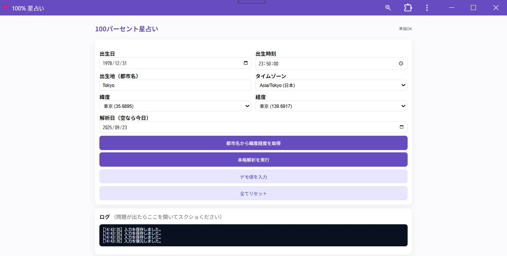

# 🌟 100% 星占い

**100% 星占い** は、惑星の配置を本格的に計算し、毎日の運勢を「100% スコア」で表示する占いアプリです。  
12星座占いのような大まかな分類ではなく、**恋愛・仕事・金運・健康** などを数値と解説で具体的に示します。

---

## 🚀 実行ページ

👉 [100% 星占いを開く](https://masato-nasu.github.io/horoscope-100pct/)

※スマートフォンでアクセスすると、ホーム画面に追加してアプリのように使えます。

---

## 📸 スクリーンショット

### トップ画面

### 結果画面

---

## 🔮 特長

- **本格的な天体計算** — 惑星どうしの角度や強さを解析  
- **100% スコア表示** — 迷ったときに役立つ絶対評価  
- **ジャンル別アドバイス** — 恋愛・仕事・金運・健康を丁寧に解説  
- **毎日使える言葉** — 難しい専門用語なし、生活に寄り添う占い  

---

## 📲 インストール方法（PWA）

このアプリはブラウザから **無料でホーム画面に追加できる PWA（Progressive Web App）** です。  
ストアからのインストールは不要で、軽快に使えます。

### Android の場合（Chrome）
1. アプリのページを Chrome で開く  
2. 右上メニュー「︙」をタップ  
3. 「アプリをインストール」 または 「ホーム画面に追加」 を選択  
4. ホーム画面にアイコン（ハート）が追加されます  

### iPhone / iPad の場合（Safari）
1. アプリのページを Safari で開く  
2. 下部の共有ボタン「□↑」をタップ  
3. メニューから 「ホーム画面に追加」 を選択  
4. 右上の「追加」を押すと、ホーム画面にアイコン（ハート）が並びます  

---

## ⚙️ アルゴリズム概要

1. **天体位置の計算**  
   出生日と解析日（正午固定）の2つの時点での **黄経（Ecliptic Longitude = 天球上の360°座標）** を算出  

2. **アスペクト検出**  
   天体どうしの角度差 Δ を求め、以下の条件で判定  
   - 0° ±8° → コンジャンクション  
   - 60° ±6° → セクスタイル  
   - 90° ±8° → スクエア  
   - 120° ±8° → トライン  
   - 180° ±8° → オポジション  

3. **カテゴリ別スコア化**  
   アスペクトの強さ × 惑星の重要度を加算し、  
   シグモイド関数 `1/(1+exp(-x))` で 0〜100% に正規化  

4. **文章生成**  
   スコアに応じて「好調 / 普通 / 注意」に分類し、  
   テンプレートから日付固定乱数で 5行を選出（同じ日なら結果は変わらない）  

---

✨ 「100% 星占い」は、今日の運勢を数字とアドバイスで明確に示す新しい占いです。  
毎朝のチェックで、1日のヒントにしてください。

---

## 🆕 追加機能（2025-10-11）

- 📰 **ニュース＋季節感の自動反映**  
  `NewsAPI.org` の APIキーを設定すると、日本のトップニュース見出し（1〜2件）を取得し、  
  解析日の季節表現と組み合わせて「今日の空気感」として表示します。  
  キーは `index.html` 内の `NEWS_API_KEY` に記入してください。

- 🎂 **誕生日特別モード**  
  出生日の “月日” と解析日の “月日” が一致した場合、  
  祝福メッセージを表示し、全スコアを +5%（最大100）補正します。

- 🖼️ **結果をJPEG保存**（UI変更なし）  
  結果カード（#output）を **長押し** するとJPEG保存ダイアログが開きます。  
  また、キーボード **S** でも保存可能。`?dl=1` をURLに付与すると自動保存します。  
  （内部では `html2canvas` を利用）

- ♻️ **文面の重複ガード**  
  同じ日付の中だけでなく、**直近120日**で使用した文言をローカルに記録して避けます。  
  （`localStorage` に `usedLinesGlobal` として保存）

